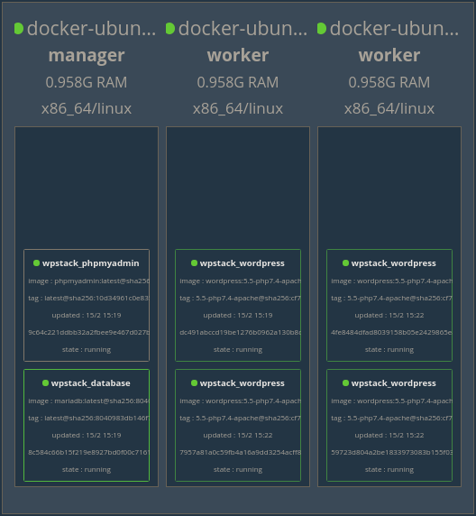

# Wordpress Docker

#### Run a scalable and a high availability Wordpress website in Docker swarm

### Running

Run stack:

```bash
docker stack deploy --compose-file docker-compose.yml wpstack
```

Re-scale wordpress service:

```bash
docker service scale wpstack_wordpress=4
```

Remove stack:

```bash
docker stack rm wpstack
```

### Features

- encrypted overlay network
- wordpress volume mounted to a shared persistance storage array
- database performance configured for a server with 4CPUs and 8GB of RAM

### Model

Image is showing the stack running on three Ubuntu demo servers. Database is on the manager node, and two wordpress instances on each worker node.



### TODO

- [ ] persistant storage for multiple wordpress instances
- [ ] docker secrets for storing passwords
- [ ] traefik or some kind of proxy
- [ ] pimp database performance

#### Help guides:

- https://maddevs.io/blog/deploy-and-scale-wordpress-with-docker-cloud-swarm-mode/
- https://hackernoon.com/architecting-a-highly-available-and-scalable-wordpress-using-docker-swarm-traefik-glusterfs-a69186e9f0e
- https://thenewstack.io/tutorial-create-a-docker-swarm-with-persistent-storage-using-glusterfs/
